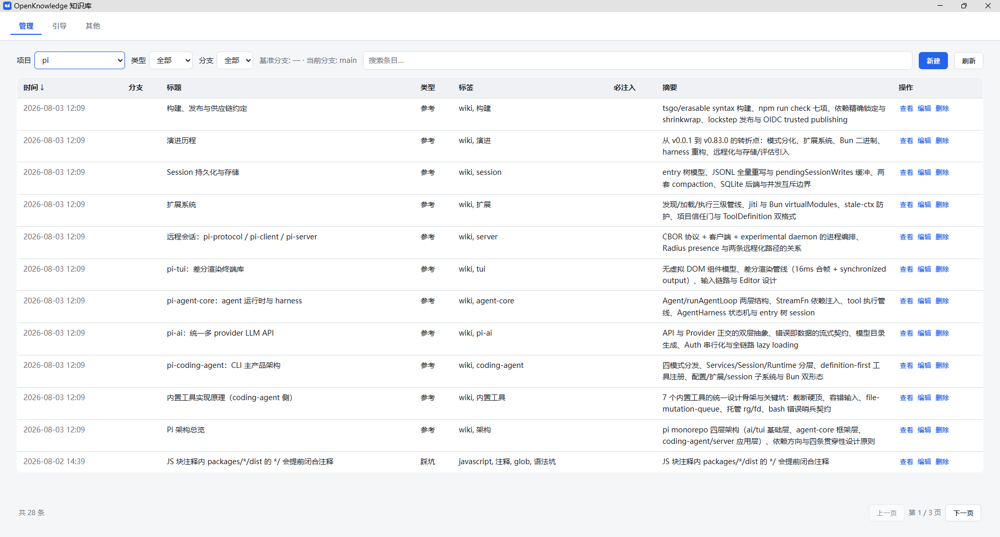
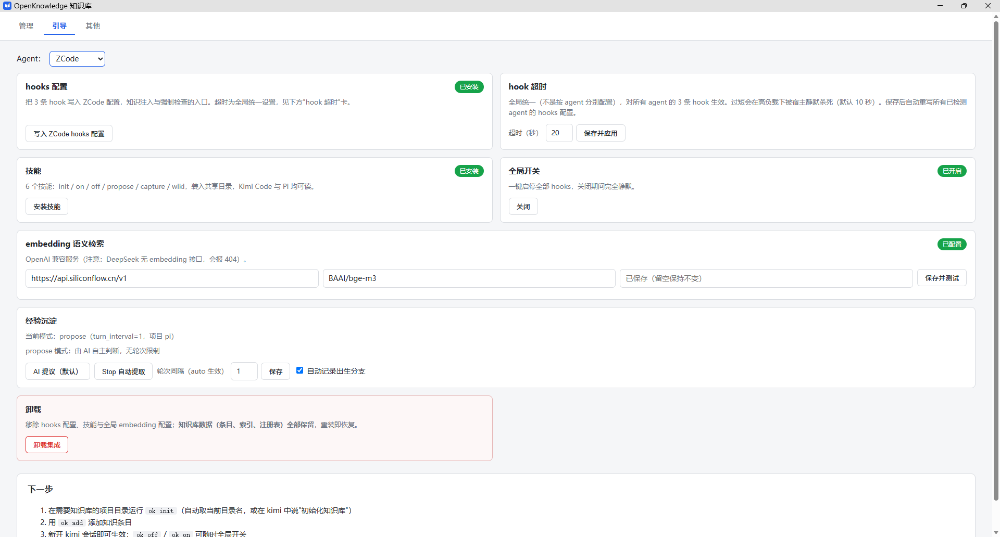
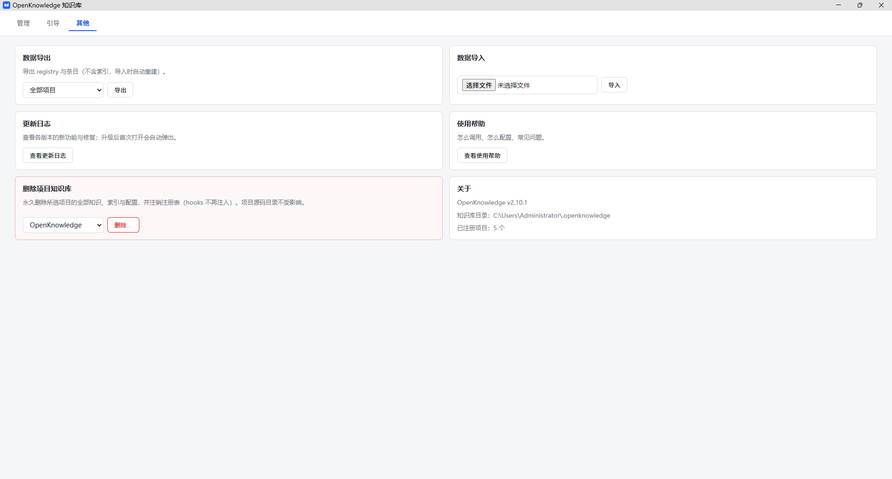
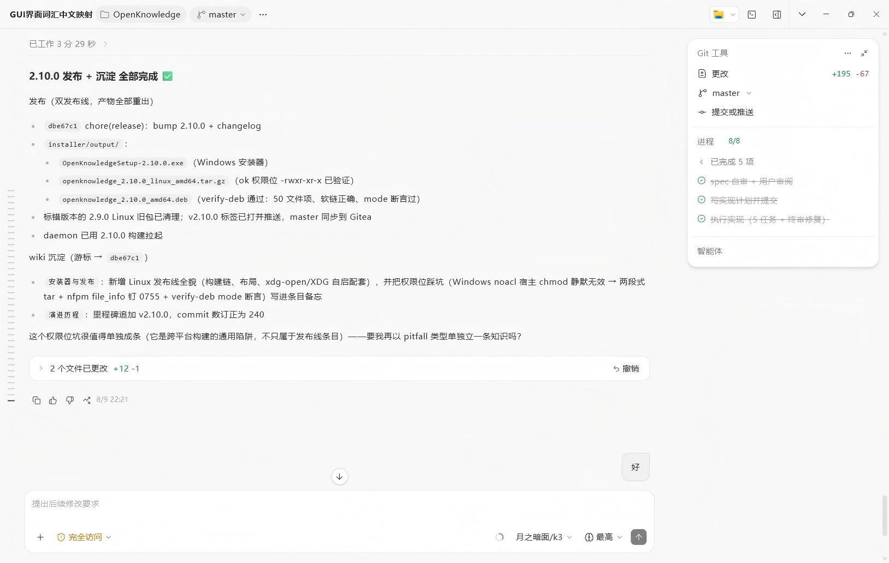

<p align="center">
  
</p>

<p align="center">
  <b>简体中文</b> · <a href="README_EN.md">English</a> · <a href="docs/ARCHITECTURE.md">架构文档</a> · <a href="docs/changelogs/">更新日志</a>
</p>

<p align="center">
  
  
  
  <a href="LICENSE"></a>
</p>

<p align="center">
  为 AI 编程助手提供的<b>项目知识库</b>——知识按项目隔离，通过各 AI 助手的 hooks/扩展自动注入 AI 上下文，<br>
  并能强制执行"改代码必须写变更日志"这类工作流规则。单二进制 Go CLI（<code>ok</code>），零运行时依赖。
</p>

---

## 目录

- [功能特性](#功能特性)
- [安装](#安装)
- [快速开始](#快速开始)
- [Web GUI](#web-gui)
- [知识条目](#知识条目)
- [常用命令](#常用命令)
- [配置](#配置)
- [检索算法](#检索算法)
- [工作原理](#工作原理)
- [开发](#开发)

## 功能特性

| 特性 | 说明 |
|------|------|
| **基础注入** | 每个会话首次提问时，自动把项目的强制约定（mandatory 条目）全文 + 知识索引发送给 AI |
| **检索注入** | 每次提问按关键词 + 向量语义混合检索，把最相关的知识条目注入上下文（如"git 提交规范"） |
| **强制检查** | 跟踪 AI 改过的文件；回合结束时发现改了代码却没写变更日志，就阻断并要求补齐（同会话同规则只阻断一次） |
| **多 Agent 支持** | Kimi Code、Pi、ZCode、Reasonix、opencode、Claude Code/CodePilot、Codex 共用同一套知识库（可扩展适配器架构）——kimi 走 TOML hooks 标记块，pi 走 TypeScript 扩展，zcode 走 Claude JSON 协议，reasonix 走 Extension Protocol sidecar，opencode 走 TypeScript 插件 hooks，claude 走 ~/.claude/settings.json 合并写（Claude Code / CodePilot 等兼容宿主共用），codex 走 ~/.codex/hooks.json 合并写（hook 契约兼容 Claude，技能零适配共享 ~/.agents/skills） |
| **一键引导** | `ok setup` 自动完成 hooks 配置、技能安装与 embedding 配置 |
| **随时开关** | `ok off` 全局停用，`ok on` 一键恢复 |
| **Web GUI 与常驻 Daemon** | 双击 exe 或 `ok gui` 打开管理界面；全系统仅一个常驻 `ok.exe daemon` 进程（登录自启），统一承载 GUI 与各 agent 的 hook 请求——毫秒级转发，多会话不再起多个进程 |

## 安装

### 方式 A：Windows 安装程序（推荐给最终用户）

直接运行发布产物 `OpenKnowledgeSetup-<版本>.exe`——无需安装 Go、无需任何构建步骤。默认安装到 `%LOCALAPPDATA%\Programs\OpenKnowledge`（免管理员权限），可选桌面快捷方式 / 加入 PATH / 安装后自动运行首次引导。卸载默认保留知识库数据（交互卸载时可选删除，静默卸载一律保留）。

<details>
<summary>维护者：自行打包安装程序</summary>

```bash
bash scripts/build-installer.sh   # 产出 installer/output/OpenKnowledgeSetup-<版本>.exe
```

</details>

### 方式 B：Linux（amd64）

发布产物提供两种格式（均无依赖、静态编译）：

| 格式 | 安装方式 |
|------|----------|
| `openknowledge_<版本>_linux_amd64.tar.gz` | 解压后 `cd openknowledge_* && ./ok setup`（写 hooks/技能 + 配置登录自启；自启 Exec 指向解压目录，删除目录前请先 uninstall 或重新 setup） |
| `openknowledge_<版本>_amd64.deb` | `sudo dpkg -i` 安装到 `/usr/lib/openknowledge/`（`ok` 进 PATH），然后运行 `ok setup` |

<details>
<summary>维护者：构建 Linux 发布包</summary>

```bash
bash scripts/build-linux.sh   # .deb 需先 go install github.com/goreleaser/nfpm/v2/cmd/nfpm@latest
```

</details>

### 方式 C：手动构建

```bash
# 1. 构建（Go ≥ 1.25）
go build -o ok.exe ./cmd/ok        # Windows
go build -o ok ./cmd/ok            # Linux/macOS

# 2. 首次引导（幂等，可重复执行）
./ok.exe setup
```

`ok setup` 会依次完成三件事：

1. **写入 hooks 配置**——覆盖全部已检测的 AI 助手：kimi 是 `~/.kimi-code/config.toml` 的 3 条 hook 标记块（幂等，自动备份；已存在的 ok hooks 会被检测并覆盖更新 exe 路径，不重复堆积），pi 是 TypeScript 扩展，zcode 是 `config.json` 合并写，opencode 是 `~/.config/opencode/plugins/` 的 TypeScript 插件，claude 是 `~/.claude/settings.json` 的 hooks 合并写，codex 是 `~/.codex/hooks.json` 的 hooks 合并写；`ok setup --agent <id>` 可只装指定 agent
2. **安装六个技能**——`openknowledge-init / on / off / propose / capture / wiki`，写入各 agent 的技能目录（kimi/pi/opencode/codex 共享 `~/.agents/skills/`，zcode 为 `~/.zcode/skills`，claude 为 `~/.claude/skills`）
3. **配置 embedding**——交互询问 base_url / model / API key（可直接粘贴；回车跳过则只用关键词检索），写入全局配置并当场验证连通性

## 快速开始

```bash
# 在需要使用知识库的项目目录里
cd /your/project
ok init                      # 注册项目（自动取目录名）
ok add --title "变更日志强制规则" --type rule --mandatory --file rule.md
ok add --title "Git 提交规范" --type note --tags git --file git.md
ok index                     # 配好 embedding 后同步索引与向量
```

然后**新开一个 AI 助手会话**（hooks 在会话启动时加载）即可生效：

- 问 "git 提交规范是什么" → AI 直接引用知识库内容回答
- AI 改了代码没写变更日志 → 回合结束时被阻断提醒

也可以在会话里直接说"初始化知识库""关闭知识库 hooks"——对应技能会自动调用。

## Web GUI

**双击 `ok.exe`（无参数运行）或执行 `ok gui`** 即可启动 Web 管理界面：浏览器自动打开 `http://127.0.0.1:17888`（固定端口兼作单实例锁；访问令牌随页面自动注入，不出现在 URL 里）。GUI 由 daemon 托管，关闭页面/窗口不会退出进程；用 `ok daemon stop` 停止常驻服务。

<p align="center">
  <br>
  <sub>管理页：项目 / 条目列表、检索预览与全局开关</sub>
</p>

<p align="center">
  <br>
  <sub>引导页：一键完成 hooks、技能与 embedding 配置</sub>
</p>

<p align="center">
  <br>
  <sub>其他页：数据导出 / 导入、更新日志与删除项目知识库</sub>
</p>

| 标签页 | 功能 |
|--------|------|
| **管理** | 项目/条目列表，新建、编辑、删除条目，检索预览，全局开关。项目下拉按最近知识更新排序；条目行带 ⎇出生分支/⇢适用分支双徽标与分支过滤器；每页 12 条；摘要列两行截断、悬停浮窗显示全文；「刷新」按钮全量拉齐项目列表与条目。首次使用（hooks 未安装）时该页自动隐藏 |
| **引导** | 一键完成 hooks 配置、技能安装、embedding 配置（等价于 `ok setup` 的图形版），另有 hook 超时可配、「强制检查方式」三档卡（reasonix 专属）与「卸载」卡片（移除全部集成，知识库数据保留）。完成后进入管理页 |
| **其他** | 数据导出/导入（知识库 zip 备份与恢复，含同名覆盖与索引重建）、更新日志与使用帮助、**删除项目知识库**（三重确认：影响面明示 + 默认勾选的删除前 zip 备份 + 勾选了解后果并输入完整项目名解锁）、版本显示与项目数 |

GUI 需要 `web/` 目录与 `ok.exe` 同级（或当前目录有 `web/`）。用发布构建脚本一次产出两者：

```bash
bash scripts/build-dist.sh   # 产出 dist/ok.exe + dist/web/
```

## 知识条目

每条知识是一个带 frontmatter 的 Markdown 文件（`ok add` 创建，也可手写）：

```markdown
---
title: 变更日志强制规则
type: rule              # rule | pitfall | note | reference
tags: [changelog, workflow]
mandatory: true         # true = 每会话首次提问全文注入
summary: 每次代码修改必须立即记录变更日志
---

正文（Markdown 自由格式）
```

数据存放在 `~/.openknowledge/`（集中存储，不污染项目仓库）。

**草稿流程（AI 提议，人批准）**：AI 可通过 `ok propose` 把会话中沉淀的经验记为**草稿条目**（frontmatter `draft: true`）——草稿不参与检索与注入，只出现在 `ok list` 和 GUI 管理页（带「草稿」徽标）。人确认后用 `ok approve <文件>` 或 GUI 的「采纳」按钮转正。

沉淀模式用 `ok capture propose|auto` 切换：`propose` 为 AI 主动提议（默认，无轮次限制）；`auto` 则由 Stop hook 每隔指定轮次强制 AI 自省提取经验，轮次间隔用 `ok capture interval <n>` 配置（仅 auto 生效）。

<p align="center">
  <br>
  <sub>实际会话：一次发布完成后，AI 主动沉淀 wiki 条目，并询问是否要把踩坑单独记为 pitfall（propose 模式）</sub>
</p>

## 常用命令

| 命令 | 作用 |
|------|------|
| `ok setup` | 首次引导：hooks 配置 + 技能安装 + embedding 配置 |
| `ok gui` | 启动 Web 管理界面（双击 exe 无参数运行同效） |
| `ok daemon [stop]` | 常驻进程：承载 GUI 与 hook 转发（开机自启，一般无需手动操作） |
| `ok init [名字]` | 注册当前项目（名字缺省取目录名），并幂等写入/更新 hooks 配置 |
| `ok add` | 新建知识条目（自动重建索引与向量） |
| `ok propose` | AI 提议草稿条目（不参与检索，待人批准） |
| `ok approve <文件>` | 批准草稿转正（同步索引与向量） |
| `ok backfill-born` | 回填存量条目的 born 分支溯源标签（预览确认后写入，已有值不覆盖） |
| `ok capture [propose\|auto\|interval <n>]` | 查看/切换经验沉淀模式，配置轮次间隔 |
| `ok wiki status` / `mark` / `base` / `diff` | wiki 状态（JSON）/ 记游标 / 查看或设置基准分支 / 输出分支差异素材 |
| `ok search <词>` | 命令行预览检索效果 |
| `ok index` | 同步索引与向量（手改条目后执行；删除 kb.db 后执行 = 全量重建） |
| `ok list` | 列出项目与条目 |
| `ok doctor` | 体检：配置、embedding 连通性、hooks 状态 |
| `ok on` / `ok off` | 全局开关（默认开启） |

## 配置

生效配置 = 内置默认 ← 全局 `~/.openknowledge/config.toml` ← 项目 `~/.openknowledge/projects/<名>/config.toml`（逐层覆盖）。

```toml
# 全局配置（ok setup 可交互写入）
[embedding]
base_url = "https://api.openai.com/v1"   # 任何 OpenAI 兼容服务
api_key = "sk-..."                        # 或用 api_key_env 指向环境变量
model = "text-embedding-3-small"

# 项目配置：强制规则示例
[[enforce]]
type = "changelog_required"
code_globs = ["**/*.go"]                  # 改了这些 = 改了代码
changelog_glob = "docs/changelogs/**"     # 碰了这些 = 写了日志
message = "本次会话修改了代码但未更新变更日志，请先按规范补齐。"
```

## 检索算法

**用什么**：SQLite + FTS5 的混合检索——

- **关键词通道**：FTS5 全文索引 + BM25 打分（稀有词更值钱、长文不占优），按 标题/标签/摘要/正文 分权重；中文用二元组分词，零依赖
- **语义通道**：OpenAI 兼容 embedding + 余弦相似度，召回"问法不同但意思相近"的条目
- 两路分数归一化后加权混合（α/β 可调），取 top-2 注入（`top_n` 可配）
- **草稿条目（`ok propose` 产生）不进检索通道**：FTS 与向量都排除，批准后自动参与

**为什么这么选**：关键词和语义互补是检索质量的基本盘；用 SQLite（纯 Go 移植，无 CGO）承载索引而不是引入向量数据库/搜索服务，是为了守住"单二进制、零基础设施"的部署形态——一个 `kb.db` 文件就是全部。

**能达到什么**：1 万条知识条目下单次查询约 30ms（含索引同步的热路径约 36ms）；embedding 服务不可用时自动降级为纯关键词检索，注入永不缺席。详见 [ARCHITECTURE 第 17 章](docs/ARCHITECTURE.md#17-检索算法实现深度)。

## 工作原理

以 Kimi Code 为例，AI 助手在三个时机调用 `ok`（其他 agent 经各自适配器等价触发）：

| Hook | 何时执行 | ok 内部放行条件 | 作用 |
|------|----------|----------------|------|
| `UserPromptSubmit` | 每条用户消息、模型调用之前 | 全局开关开 + 目录已注册 | 首次提问注入 mandatory + 索引；每次提问检索注入 |
| `PostToolUse`（matcher `Write\|Edit`） | AI 用 Write/Edit 成功改完文件后（失败不触发） | 开关 + 注册 + 能解析出项目相对路径 | 把改动文件记入会话状态 |
| `Stop` | AI 每个回合即将结束时（Esc 中断不触发） | 开关 + 注册 + 配了 `[[enforce]]` + 满足规则条件 | 改了代码没写日志 → exit 2 阻断（同会话同规则只阻断一次） |

所有 hook 路径 fail-open：任何内部错误只记日志（`~/.openknowledge/ok.log`），绝不影响正常会话。详见 [docs/ARCHITECTURE.md](docs/ARCHITECTURE.md)。

## 开发

```bash
go test ./...    # 25 个包全部测试（零网络，含端到端）
go vet ./...
```

| 文档 | 位置 |
|------|------|
| 架构文档 | [docs/ARCHITECTURE.md](docs/ARCHITECTURE.md) |
| 设计文档 | `docs/superpowers/specs/2026-07-22-openknowledge-design.md` |
| 实施计划 | `docs/superpowers/plans/2026-07-22-openknowledge.md` |
| 变更日志 | [docs/changelogs/](docs/changelogs/) |
